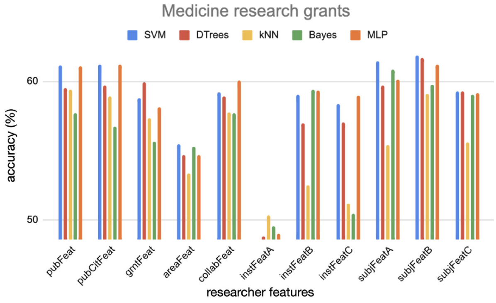
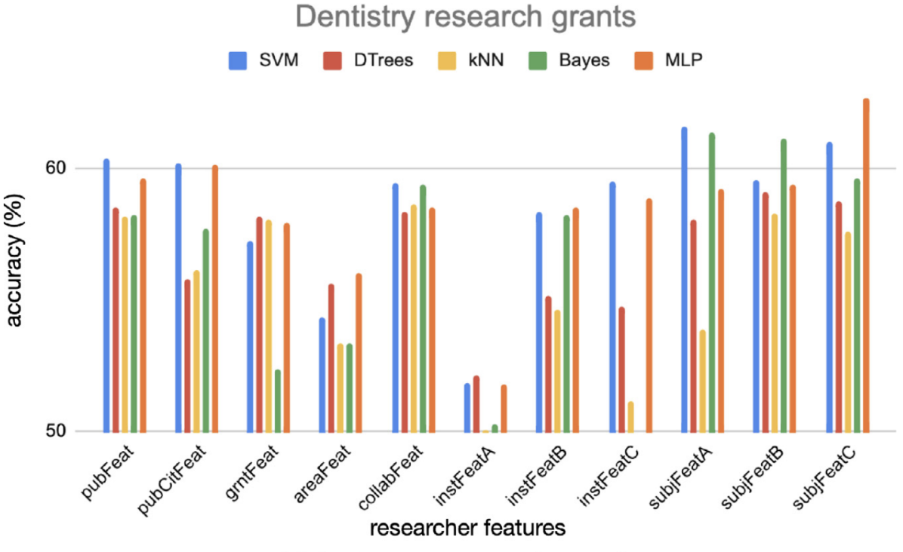
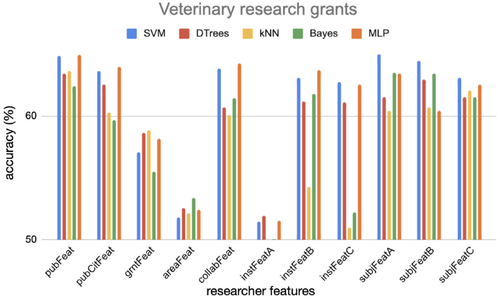

# Fapesp Classification
Classification of research grants using text features and bibliometric features. In this work I investigated whether text features extracted from the titles and abstracts of research grant proposals can be used to identify productive grants in the fields of Medicine, Dentistry, and Veterinary Medicine. I also investigated whether bibliometric features could predict the success of research grants of Brazilian researchers. I extracted features related to the researchers' academic history, including research topics, affiliations, number of publications, and visibility.
 
## Datasets

The dataset comprises a subset of grants offered by São Paulo Research Foundation (FAPESP). FAPESP is an important public research foundation in Brazil and is fully funded bythe State of São Paulo. I focused the analysis on regular grants, which are grants with an average duration of 18–24 months. I decided to study this type of grant because the Biblioteca Virtual has a large number of regular grants (roughly 31,000 instances). I selected research grants starting before 2016 with duration between 23 and 24 months. Each research grant has a list of associated publications. Grants funded by FAPESP cover a wide variety of research areas, including, e.g. Health, Biological and Earth Sciences. This analysis was conducted in the three largest fields: Medicine (MED), Dentistry (DENT) and Veterinary Medicine (VET).

## Methodology
In order to classify research grants according to their productivity, the following steps were taken:
- **Dataset collection**: the dataset I used comprises research projects supported by São Paulo Research Foundation (FAPESP-Brazil). The dataset is available from the Biblioteca Virtual website. In addition to the information regarding research projects (number of papers derived from the grant, title, abstract etc), the dataset also provides information to characterize PIs (e.g., their publication history) and institutions (e.g. universities and research institutes).
- **Feature extraction**: this step is responsible for extracting features from researchers that are used to predict grants productivity. My hypothesis is that the success of a grant could be dependent on PIs features, such as previous success in other grants and publication/citation history. Several features were extracted to characterize authors. Examples of extracted features are: number of funded projects, number of publications and citations yielded by the researcher’s grants, affiliation and diversity of subfields studied by the researcher. 
- **Classification**: the aim of this phase is automatically identify productive research proposals according to the established criteria for productivity. I considered a binary classification task. The features extracted from the previous step were used as input for traditional machine learning algorithms. I also performed several tests in order to find the best combination of features. 

In the following figure, the architecture for research grant classification is shown. First, I collected relevant information from the FAPESP Dataset (FAPESP Virtual Library). This includes information from PIs that are related to their previous research experience and other features linked to their professional activity. All information from researchers are collected in the researcher dataset. Examples of features extracted are the number of publications obtained in previous grants (pubFeat), number of citations received by these publications (pubCitFeat) and other features. These features are used to train supervised classifiers in a binary classification task to predict whether a grant will be productive. I used the number of publications resulting from the grant as the criterion to measure productivity.

## Main results
In the following figure are shown the results based on accuracy rate obtained from the evaluation of each researcher feature. I considered projects from the Medicine, Dentistry and Veterinary Medicine areas. From each researcher I considered seven features and their variations. I found that research subject and publication history play a role in predicting productivity, and institution-based features were relevant when combined with other features. 

## References
[Analyzing the relationship between text features and grants productivity](https://link.springer.com/article/10.1007/s11192-021-03926-x). JAV Tohalino, LVC Quispe, DR Amancio. Scientometrics 126, 4255-4275

[On predicting research grants productivity via machine learning](https://www.sciencedirect.com/science/article/abs/pii/S1751157722000128). JAV Tohalino, DR Amancio. Journal of Informetrics 16 (2), 101260
 
