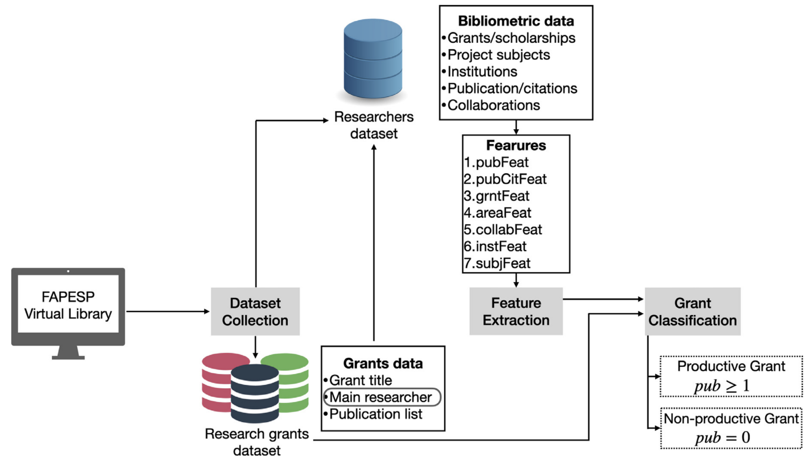

# FapespClassification
Classification of research grants using text features and bibliometric features

This paper investigates whether text features extracted from the titles and abstracts of research grant proposals can be used to identify productive grants in the fields of Medicine, Dentistry, and Veterinary Medicine. We used complexity and topical features to identify predictors of productivity and we found that there is a statistically significant relationship between text features and grant productivity, although the dependence is weak. The abstract text length and metrics derived from lexical diversity were among the most discriminative features. We found that text features should be used in combination with other features to assist in the identification of relevant research ideas. This study used a dataset of research grants funded by São Paulo Research Foundation (FAPESP-Brazil) and limited the sense of productivity by considering that productive grants are those yielding at least one publication.

This paper aimed to investigate whether bibliometric features could predict the success of research grants of Brazilian researchers in Medicine, Dentistry, and Veterinary Medicine. We extracted features related to the researchers' academic history, including research topics, affiliations, number of publications, and visibility. We then used machine learning to predict grant productivity. We found that research subject and publication history play a role in predicting productivity, and institution-based features were relevant when combined with other features. 

## Datasets
aa

## Methodology

## Main results
aa

## References
[Analyzing the relationship between text features and grants productivity](https://link.springer.com/article/10.1007/s11192-021-03926-x). JAV Tohalino, LVC Quispe, DR Amancio. Scientometrics 126, 4255-4275

[On predicting research grants productivity via machine learning](https://www.sciencedirect.com/science/article/abs/pii/S1751157722000128). JAV Tohalino, DR Amancio. Journal of Informetrics 16 (2), 101260
